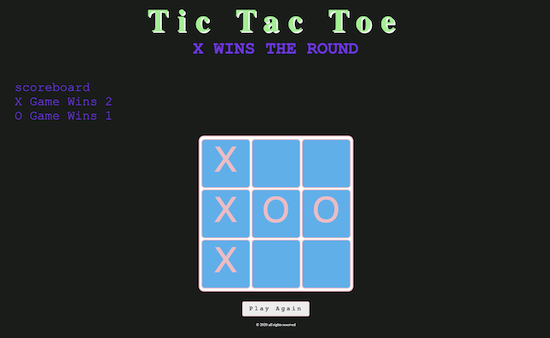

#  Project #0: Tic Tac Toe

### Game Hosted@ https://robertstoelhorst.github.io/Project0/

Let's start out with something fun - **a game!**

**We'll be making Tic Tac Toe**, a game that takes seconds to learn but minutes to master!

> This was my very first project and for many a great starting point, I highly recommend having a go as there is soo many different ways to go about building this game, It can probably be built in any language you are learning on. For me at the time it was plain HTML5 CSS3 Javascript/ES6 with the Jquery library.

### What I've Learned

for me this was totally all about learning some base level developer logic, program structure and starting to understand the DOM!

while there are some sections of the code I look at and have to ponder and take some time to understand what is happening over all this project makes sense as to how it all works.

- **Command Line**: Practice interacting with the computer and navigating the filesystem from the command line.
- **Source Control**: Manage and interact with a git repository to store changes to code.
- **Programming Fundamentals**: Work with array, objects, event handlers and callbacks, while learning how to strategically solve problems and resolve errors.
- **Web Fundamentals**:  Learn how communication happens over the internet, and how to structure, style, and animate documents within a browser. Also learn how to respond to actions your users take and the data they input into the browser.
- **Browser Applications**:  Dive into CSS, Sass, and how to use libraries and frameworks to get lots of style for free.
- **Deployment**: Host a static web site in a managed hosting environment.
- **Products and Teams**: Document your code and your code repository so others understand what you've built.

### To Do's

I have a bug with my score-board to fix sometimes i get a decimal point score returned I thought of storing the score in an array and then having a seperate function to calculate the scores, but I think there is probably a simpler way.

### Technical Acheivements

* **Render a game board in the browser**
* **Switch turns** between X and O (or whichever markers you select)
* **Visually display which side won** if a player gets three in a row or show a draw/"cat’s game" if neither wins
* **Include separate HTML / CSS / JavaScript files**
* **KISS (Keep It Simple Stupid)** and **DRY (Don't Repeat Yourself)** principles, I tried ....
* Use **Javascript** for **DOM manipulation**
* **Deploy your game online**, where the rest of the world can access it
* Use **semantic markup** for HTML and CSS (adhere to best practices)

---

### Bonus

* Keep track of **multiple game rounds** with a win counter
* **Get inventive with your styling**, e.g. use hover effects or animations to spiff things up

<!--- * Allow players to **customize their tokens** (X, O, name, picture, etc)
* **Use LocalStorage** to persist data locally to allow games to continue after page refresh or loss of internet connectivity
* **Support custom board sizes**: default is 3x3 but you could allow users to choose a larger board
* **Support networked multiplayer**: https://www.firebase.com/ has a nice quickstart guide
* **TRICKIEST**: Create an AI opponent: teach Javascript to play an unbeatable game against you
--->

<!--- ### Suggested Ways to Get Started
* **Break the project down into different components** (data, presentation, views, style, DOM manipulation) and brainstorm each component individually. Use whiteboards!
* **Use your Development Tools** (console.log, inspector, alert statements, etc) to debug and solve problems
* Work through the lessons in class, **ask questions and come to office hours** when you need to. Think about adding relevant code to your Tic Tac Toe game each night, instead of, you know... _procrastinating_.
* **Commit early, commit often.** Don’t be afraid to break something because you can always go back in time to a previous version.
* **Check out Tutorial and Documentation resources** (jQuery tutorial) at home to better understand what you’ll be getting into.
* **Don’t be afraid to write code that you know you will have to remove later.** Create temporary elements (buttons, links, etc) that trigger events if real data is not available. For example, if you’re trying to figure out how to change some text when the game is over but you haven’t solved the win/lose game logic, you can create a button to simulate that until then.
--->

<!---### Useful Resources
* **[MDN Javascript Docs](https://developer.mozilla.org/en-US/docs/Web/JavaScript)** _(a great reference for all things Vanilla Javascript)_
* **[jQuery Docs](http://api.jquery.com)**
* **[Github Pages](https://pages.github.com)** _(for hosting your game)_
--->

